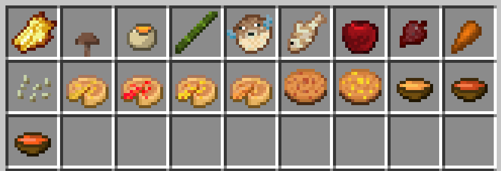
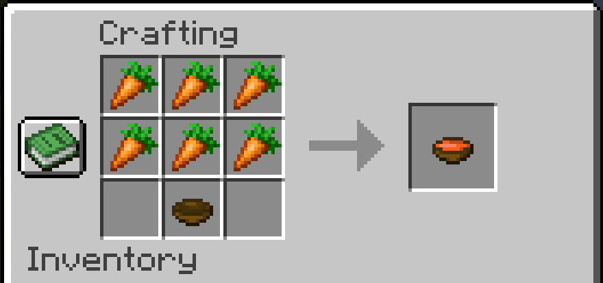
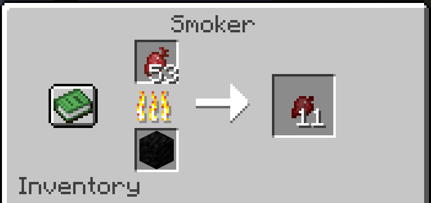
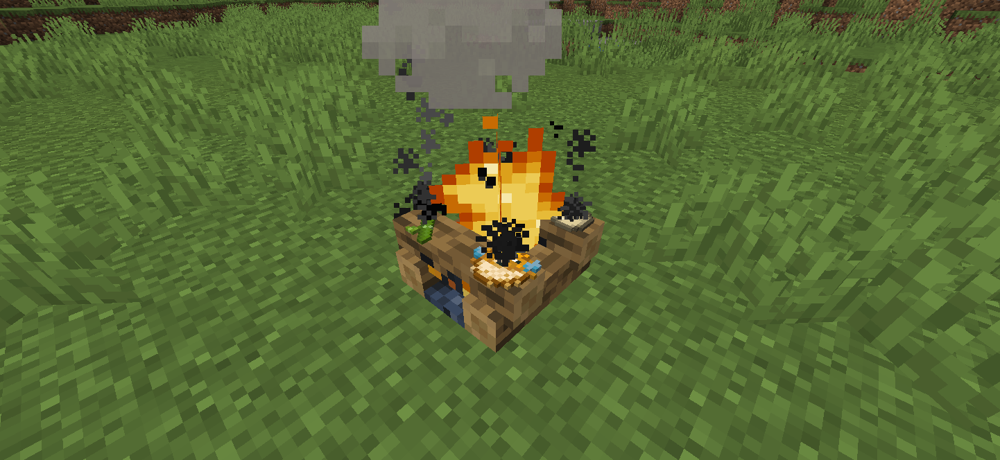

  

## Egg's better food ##

This mod enhances the Minecraft food experience by expanding the food recipes with new items like "Cooked Beetroot" and "Cured Rotten Flesh." It is designed to maintain the classic vanilla feel while introducing additional variety to the existing food options. The mod also includes corresponding recipe advancements for each new item.

Your ideas for further improvements are welcome! Please share them in the Discussions tab.

Updates will be released soon, with priority given to versions 1.19 and 1.16. Enjoy exploring the new food options and have fun!

[Curseforge](https://www.curseforge.com/minecraft/mc-mods/eggs-better-vanilla-food)

## Display ##

  

  

  

  

  

## New Food ##

Cooked Egg  

Apple Pie 

Berry Pie 

Honey Pie 

Potato Pie 

Baked Apple 

Baked Beetroot 

Baked Carrot 

Roasted Pumpkin Seeds 

Cured Rotten Flesh 

Cooked Mushroom 

Cooked Bamboo 

Cooked Pufferfish 

Cooked Tropical Fish 

Berry Cookie 

Honey Cookie 

Potato Soup 

Carrot Soup 

Pumpkin Soup
 

## Thanks ##
Thank you to Modding by Kaupenjoe on YouTube for all tutorials that helped me make this mod!
